# MÔ TẢ ĐỀ TÀI
Đề tài này nhằm xây dựng một trang tin tức có giao diện và chức năng tương tự như các trang tin tức thông thường, sử dụng framework Django của Python. Nhưng trang tin tức này sẽ cho phép người dùng đọc các bài báo mới nhất từ nhiều nguồn khác nhau cũng như danh mục khác nhau, ngoài ra trang tin tức này còn có mục tìm kiếm thông tin, lưu bài viết yêu thích và đề xuất nội dung phù hợp dựa trên sở thích cá nhân để giúp người dùng có thể quản lý dễ dàng cũng như trong việc tìm và đọc các tin tức mà mình thích.

Những vấn đề cần giải quyết trong đề tài này bao gồm:
Xây dựng hệ thống quản lý nội dung cho phép đăng tải và phân loại bài viết
Thiết kế giao diện người dùng thân thiện, tối ưu trải nghiệm đọc tin
Phát triển hệ thống tìm kiếm thông minh
Xây dựng tính năng cá nhân hóa cho người dùng: mục yêu thích và đề xuất tin tức.

Lý do chọn đề tài: Django là một framework mạnh mẽ và phổ biến trong việc phát triển các ứng dụng web với Python. Xây dựng một trang tin tức giúp nhóm áp dụng được nhiều kỹ thuật quan trọng trong phát triển web như quản lý CSDL, thu thập nhiều ngườn tin tức từ các RSS,thiết kế giao diện người dùng thân thiện.

# THÔNG TIN NHÓM

Phan Tôn Bá Sang - ``` phantonbasang@gmail.com ``` <br>
- Đảm nhận: Tạo trang giới thiệu, liên hệ, danh mục , tin tổng hợp với RSS
Trần Minh Hiếu - ``` minhhieutk5@gmail.com ``` <br>
- Đảm nhận: Tìm kiếm, Đề xuất, Mục yêu thích
Lê Quang Đỉnh - ``` dinhlequang57@gmail.com ``` <br>
- Đảm nhận: Đăng nhập, đăng ký 


# HƯỚNG DẪN CÀI ĐẶT VÀ CHẠY DỰ ÁN WEB
## Các bước cài đặt

### 1. Clone repository (nếu sử dụng Git)
```bash
git clone <repository-url>
cd <project-directory>
```

### 2. Tạo và kích hoạt môi trường ảo (Virtual Environment)
```bash
# Windows
python -m venv venv
venv\Scripts\activate

# Linux/Mac
python3 -m venv venv
source venv/bin/activate
```

### 3. Cài đặt các thư viện cần thiết
```bash
pip install -r requirements.txt
```

### 4. Cấu hình cơ sở dữ liệu
- Mở file `settings.py` trong thư mục `config`
- Cập nhật các thông tin cấu hình cơ sở dữ liệu nếu cần thiết

### 5. Chạy migrations
```bash
python manage.py makemigrations
python manage.py migrate
```

### 6. Tạo tài khoản superuser (quản trị viên)
```bash
python manage.py createsuperuser
```

### 7. Chạy server
```bash
python manage.py runserver
```

### 8. Truy cập website
- Mở trình duyệt web và truy cập: `http://127.0.0.1:8000`
- Đăng nhập với tài khoản superuser đã tạo ở bước 6

## Xử lý lỗi thường gặp
1. Nếu gặp lỗi "ModuleNotFoundError":
   - Kiểm tra môi trường ảo đã được kích hoạt chưa
   - Chạy lại lệnh `pip install -r requirements.txt`

2. Nếu gặp lỗi database:
   - Kiểm tra cấu hình database trong `settings.py`
   - Chạy lại các lệnh migration

3. Nếu gặp lỗi static files:
   - Chạy lệnh `python manage.py collectstatic`
# LINK VIDEO
``` bash
https://drive.google.com/file/d/1ClyGaTJZYHZEs2vw5rYsyiTdloQ9usm3/view?usp=sharing
```
# SCREENSHOTS
### Giao diện trang đăng ký 
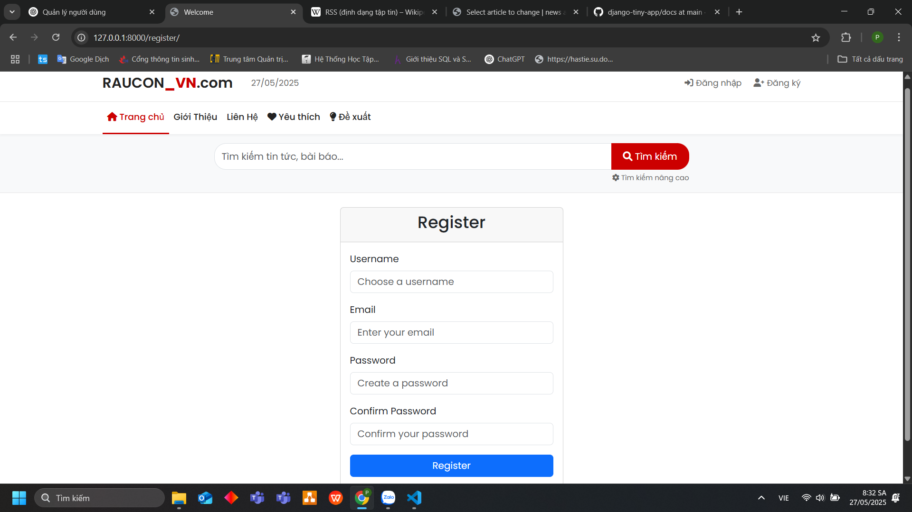
### Trang đăng nhập
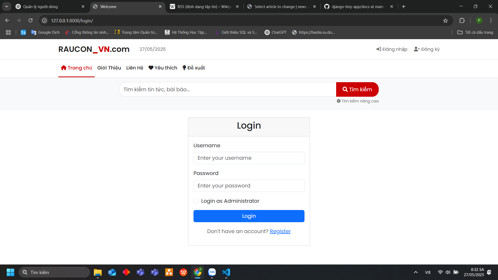
### Trang admin khi login với admin
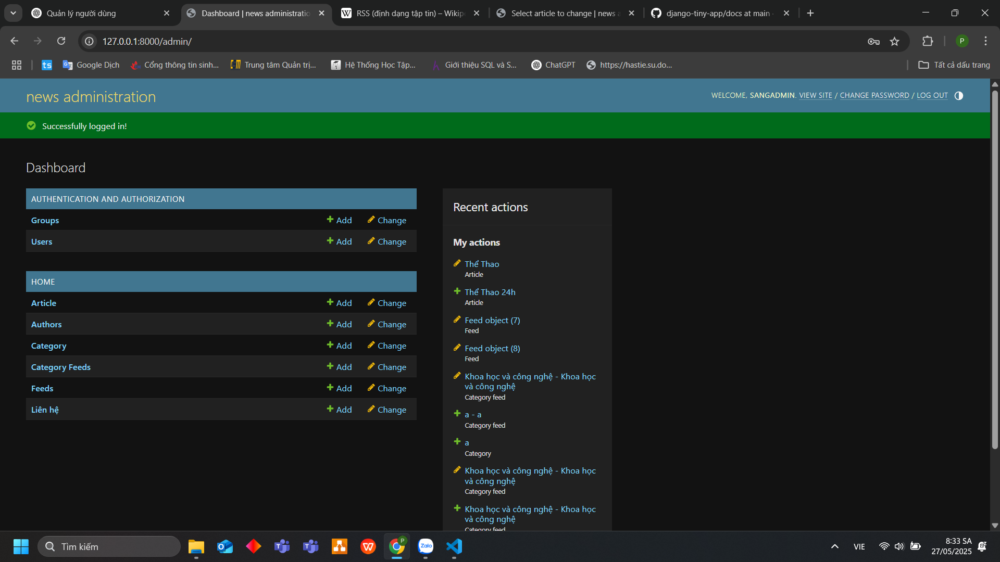
### Trang home cho user
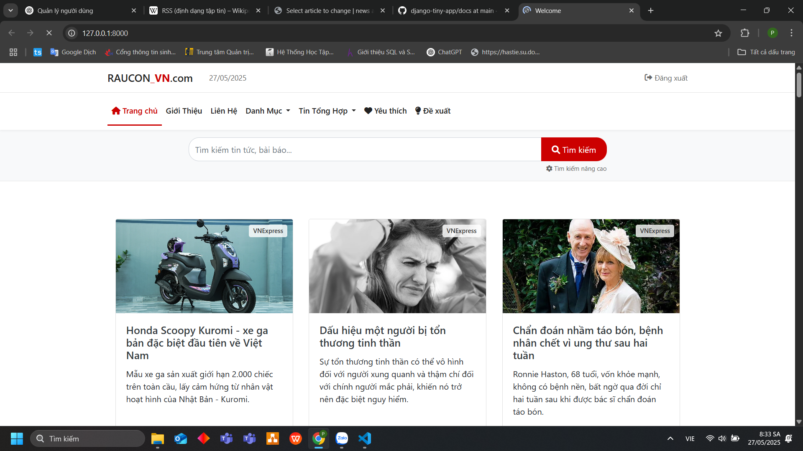
### Trang giới thiệu
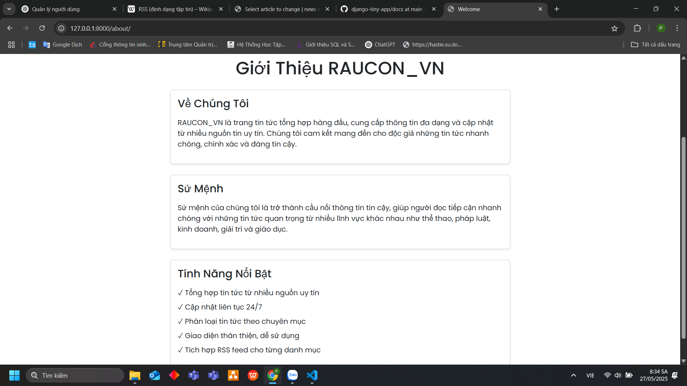
### Trang Liên hệ
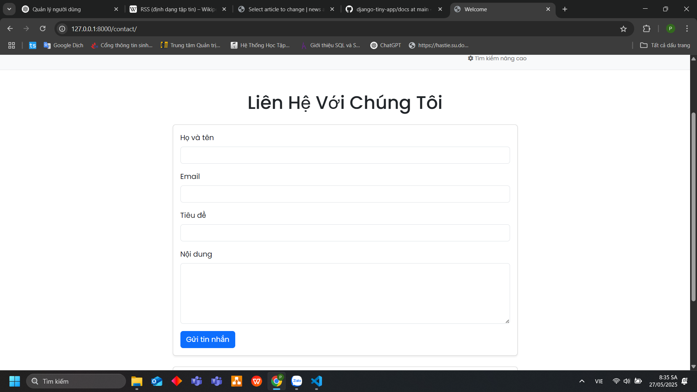
### Danh Mục (ở đây chọn danh mục thể thao)
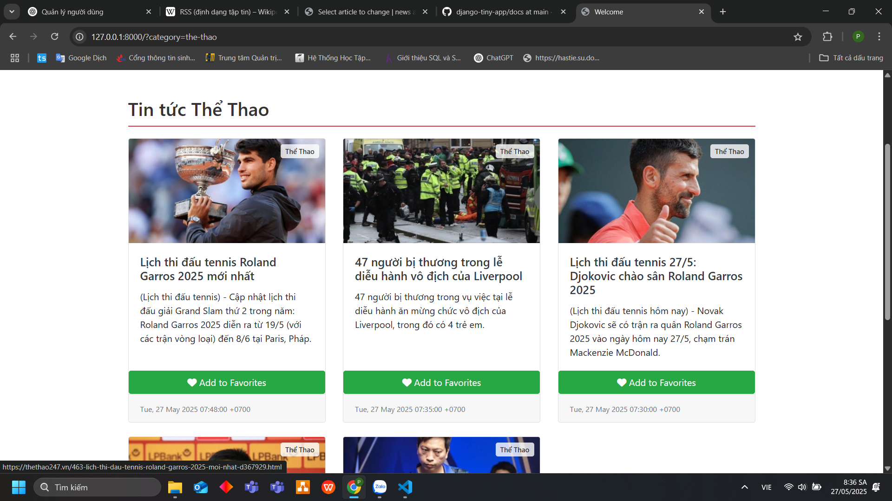
### Tin Tổng hợp (ở đây chọn VN_EXPRESS)
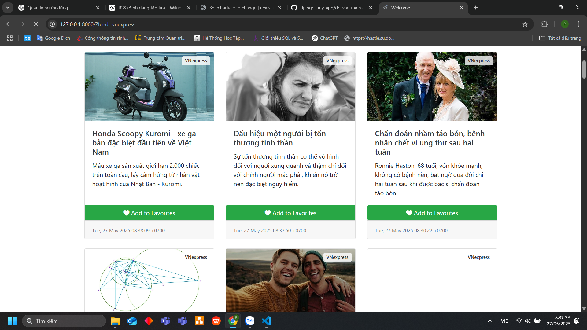
### Chức năng tìm kiếm
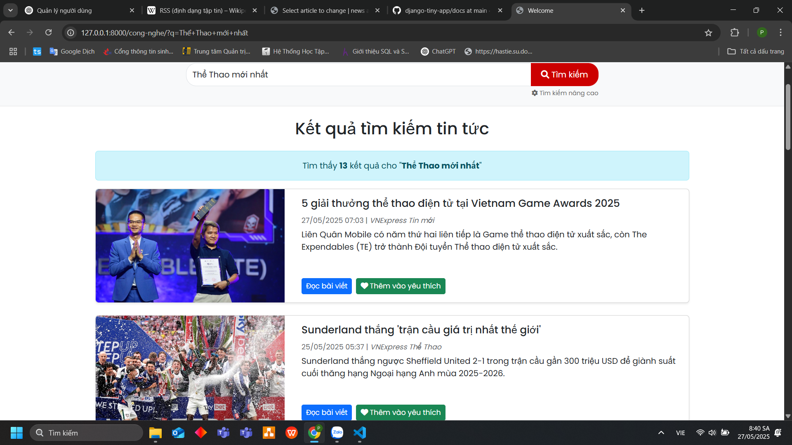
### Trang yêu thích (nếu không click vào yêu thích thì không có)
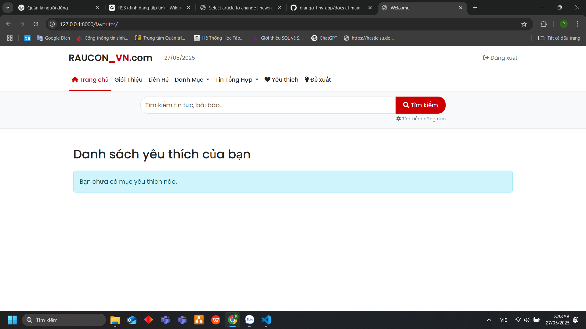
### Trang đề xuất
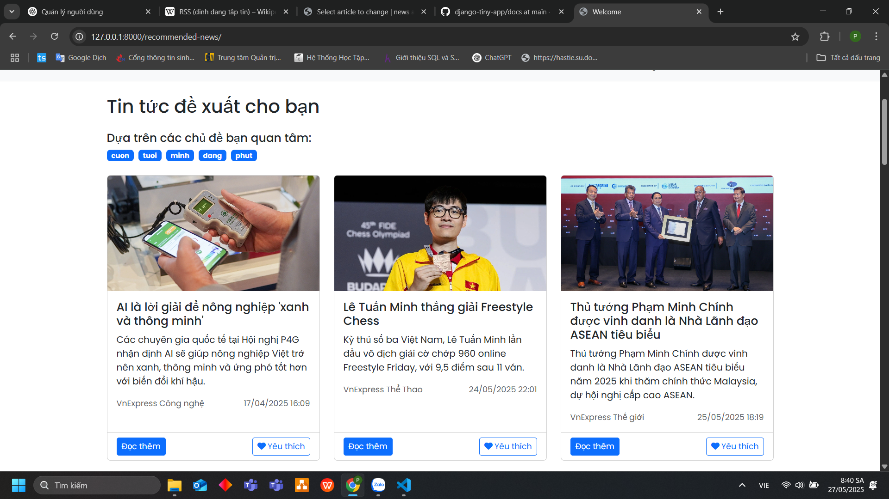


